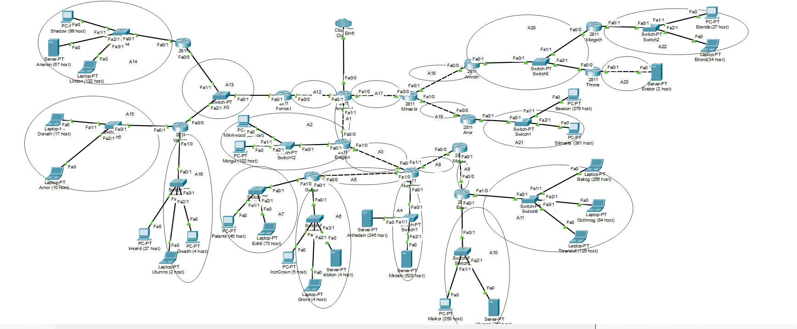
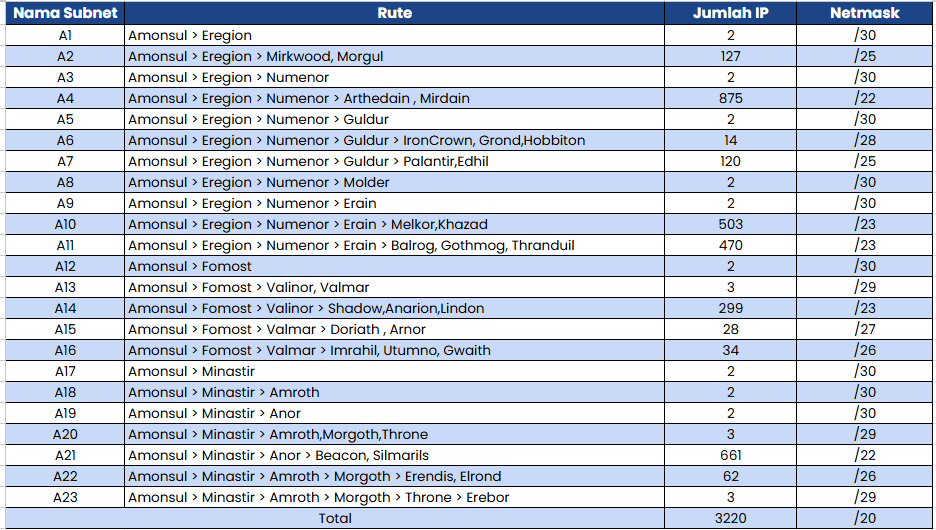
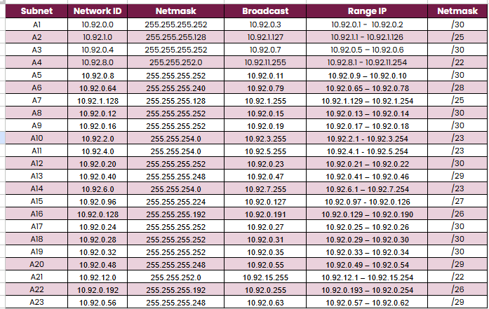
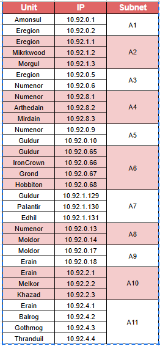
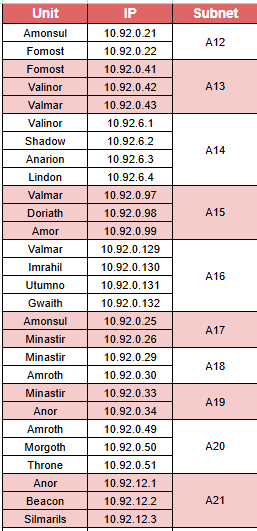
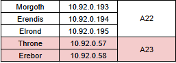
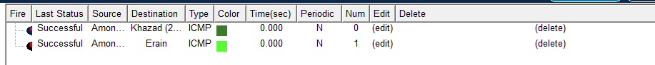
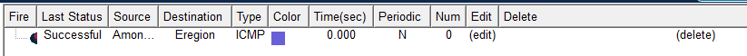
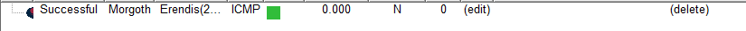
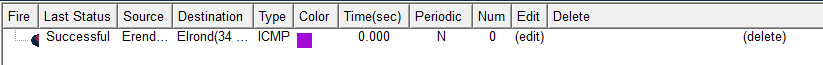

# Jarkom-Modul-4-2025-K57

| No | Nama Lengkap         | NRP        |
|----|----------------------|------------|
| 1  | Prabaswara Febrian   | 5027241069 |
| 2  | Erlinda Annisa Zahra | 5027241108 |

### VLSM CPT

Pertama membuat topologi di CPT sesuai soal. Lalu kelompokkan per subnet sesuai dengan format: 

    Router > Node
    Router > Switch > Node > Switch > Node
    Router > Switch > Node
    Router > Router

Dan kelompokkan persubnet dan menjumlah dengan hostnya untuk mendapatkan netmask.

Berikut adalah tabel rute yang dijalankan dan sudah di hitung untuk jumlah host sesuai subnet.

Lalu untuk pesebaran IP dengan perhitungan pohon. Dan untuk perhitungannya dimulai dari netmask terkecil.

lalu base kelompok ini memakai 10.92.0.0 /20

Dalam metode VLSM, syarat utama adalah mengurutkan seluruh kebutuhan subnet berdasarkan jumlah host yang paling banyak hingga yang paling sedikit. Subnet terbesar harus ditempatkan lebih dulu agar mendapatkan ruang alamat yang cukup sebelum dialokasikan untuk subnet lain yang lebih kecil.

Perhitungan VLSM dilakukan dengan menentukan ukuran subnet berdasarkan jumlah host yang dibutuhkan pada setiap segmen jaringan. Langkah pertama adalah menentukan prefix (CIDR) yang sesuai dengan menghitung jumlah alamat yang diperlukan menggunakan rumus dasar 2^(32–prefix) sehingga jumlah alamat IP yang tersedia selalu lebih besar atau sama dengan kebutuhan host ditambah dua alamat khusus (network dan broadcast). Setelah prefix masing-masing subnet ditentukan, seluruh kebutuhan subnet diurutkan dari yang terbesar hingga yang terkecil. Pengurutan ini wajib dalam VLSM agar blok dengan ukuran besar seperti subnet /22 dialokasikan terlebih dahulu sebelum ruang alamat terpecah oleh subnet yang lebih kecil.

Setelah urutan ditetapkan, proses dilanjutkan dengan menentukan Network ID, Broadcast Address, dan rentang IP (host range) untuk setiap subnet. Ukuran blok dihitung berdasarkan prefix, misalnya subnet /28 memiliki ukuran blok 16 alamat, /25 memiliki 128 alamat, dan /22 mencakup 1024 alamat. Network ID merupakan alamat pertama dari blok, sedangkan broadcast diperoleh dari Network ID ditambah ukuran blok dikurangi satu. Rentang IP host berada di antara Network ID + 1 hingga Broadcast – 1. Dengan metode ini, setiap subnet memperoleh alokasi alamat yang efisien tanpa tumpang tindih dan tetap mengikuti hierarki ukuran blok sesuai kebutuhan jaringan.

Lalu membuat konfigurasi agar bisa saling memanggil ping antar subnet maupun di subnet lain 

### Testing

- testing router ke router 

- testing router ke pc

- testing pc ke pc

